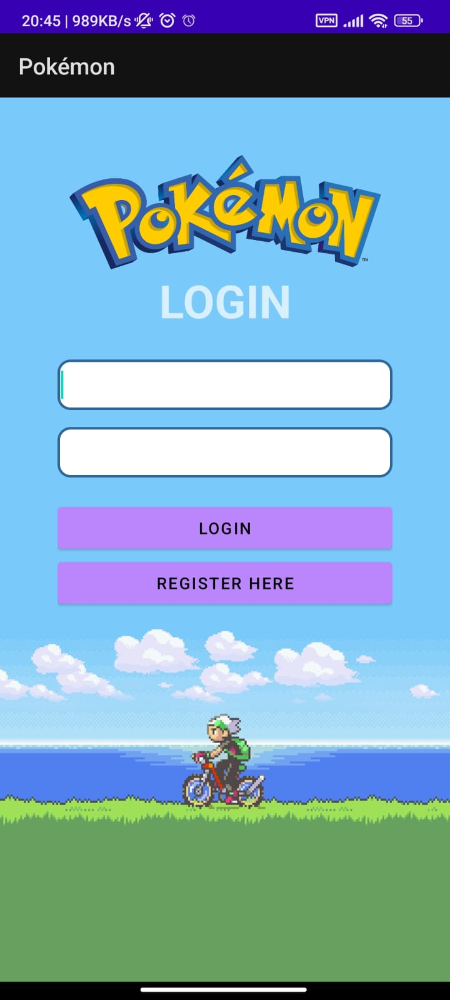
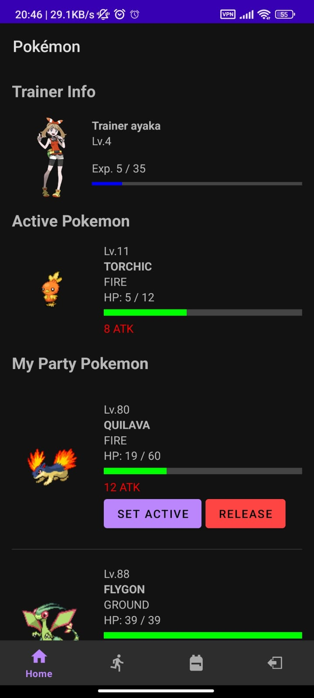
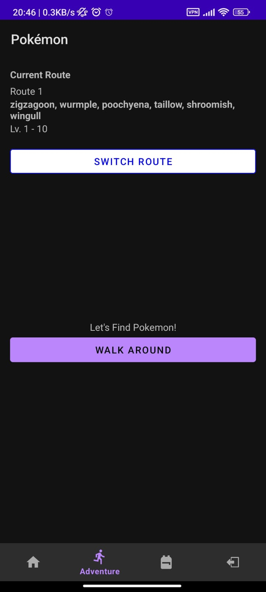
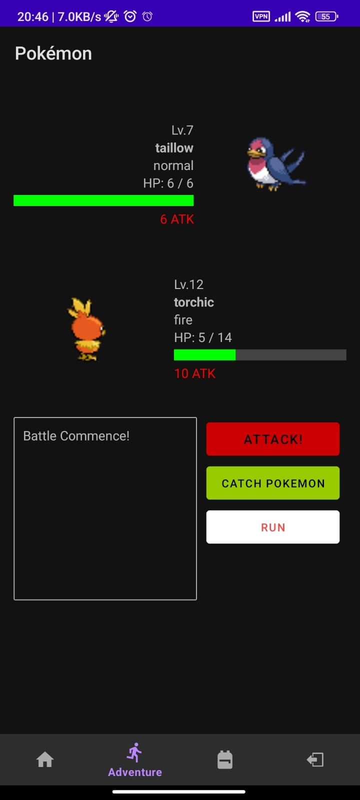
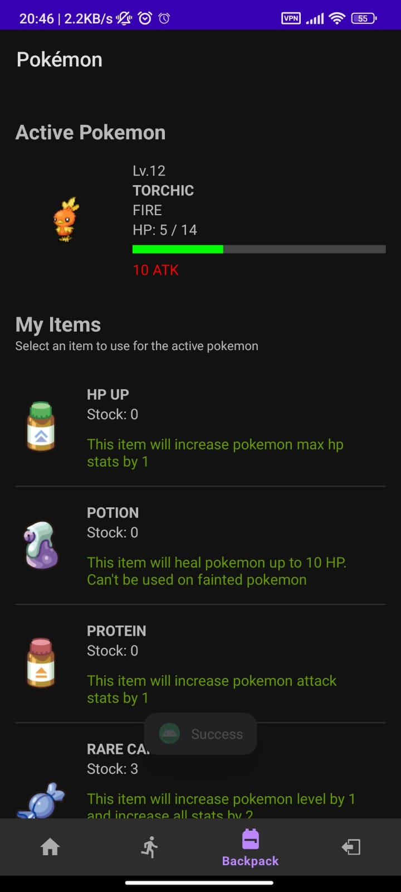

# Pokemon
This is a simple Pokemon game app where you can battle or catch Pokemon. This app is developed using Android Studio with the Java programming language. The application focuses on the backend, so the front-end or UI is not heavily styled.

## Technologies Used

- **Android Studio:** an IDE for creating Android application
- **Java:** an Object-Oriented Programming language to develop the application
- **PokeAPI:** an API to get the Pokemon's data

## Screenshots

<div style="display: flex; overflow-x: auto; gap: 50px;">
  
  
  
  
  
</div>

## Video
<iframe width="560" height="315" src="https://www.youtube.com/embed/TgFn_djJ2pk?si=Fk-Do21beQwR9JQG" title="YouTube video player" frameborder="0" allow="accelerometer; autoplay; clipboard-write; encrypted-media; gyroscope; picture-in-picture; web-share" referrerpolicy="strict-origin-when-cross-origin" allowfullscreen></iframe>

## Features

- Battle Pokemon
- Catch Pokemon
- Discover Pokemon

## Installation

To install and run this app on your Android Phone, follow these steps:

1. Clone the repository
    ```bash
    git clone https://github.com/KetsunoAna117/Pokemon.git
    ```
2. Open the project in Android Studio
3. Connect to your Android phone or select to run in a simulator
4. Build and run the project

## Usage

1. Launch the app on your Android Phone
2. Login/Register your account if you haven't
3. Use the bottom navigation bar to navigate between page
4. You can:
   a. at the home view, view your pokemon data or set an active pokemon
   b. at the adventure view, select route to discover pokemon and battle pokemon
   c. at the battle pokemon view, you can catch or defeat a pokemon (defeating a pokemon will grant you randomized item which you can see at the backpack view)
   d. at backpack view, you can use items for active pokemon
   e. use explorator kit to discover a new area for new pokemon which you can name the area yourself!

## Authors

- [@KetsunoAna117](https://www.github.com/KetsunoAna117)
- [@RussellWA](https://github.com/RussellWA)

## Contributing

Contributions are welcome! Please fork the repository and create a pull request with your changes.

## Feedback

If you have any feedback, please reach out to us at hnsarthh@gmail.com
